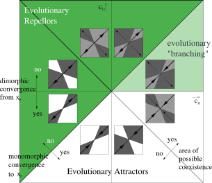

*The following project proposal is for **fourth-year students** taking the Mathematical Sciences final-year undergraduate project module for the academic year 2025/2026.*

---

## Overview

How does mathematical thinking help us understand evolutionary diversity and change? This project explores how trait variations affect populations over time using the tools of dynamical systems and mathematical modelling. Students will develop and analyse mathematical models of evolution, applying techniques including differential equations, phase plane analysis, stability analysis, and bifurcation theory, alongside computational tools for numerical exploration.

The central mathematical framework of this project is **adaptive dynamics** — a set of tools for studying how traits evolve through mutation and natural selection. Starting from ecological models of interacting populations, adaptive dynamics provides a systematic way to ask: which traits are favoured by selection, and under what conditions does evolution lead to a single dominant strategy versus the coexistence of multiple strategies?

A key object of study is the **pairwise invasibility plot (PIP)**, which encodes whether a rare mutant with trait value $c_m$ can invade a population resident at trait value $c_r$. The sign structure of the PIP determines the long-run evolutionary outcome: convergence to an evolutionary attractor, divergence from an evolutionary repellor, or **evolutionary branching** — the splitting of a population into two distinct strategies.

{fig-align="center" width="70%"}

Possible directions for the project include:

- Under what conditions does natural selection lead to a single evolutionarily stable strategy, and when does it lead to evolutionary branching and the emergence of diversity?
- How do cooperation and competition between individuals shape the evolution of strategies in social or ecological settings?
- How does within-host competition shape the evolution of pathogen virulence?

## Techniques

Students will use a combination of analytical and computational methods:

- Ordinary and/or partial differential equations and ecological modelling
- Phase portraits, stability and linearisation
- Bifurcation analysis
- Numerical simulation (MATLAB or Python)

## Prerequisites

Students should be familiar with basic concepts in differential equations and dynamical systems. Prior coding experience and an interest in mathematical modelling in the applied sciences would be helpful. The project is particularly well suited to students who have taken **Mathematical Biology III** or **Dynamical Systems III**.

## Recommended Reading

- Strogatz, S. H. (2001). *Nonlinear Dynamics and Chaos*. Westview Press.
- Diekmann, O. (2004). A beginner's guide to adaptive dynamics. *Banach Center Publications*, 63, 47–86.
- Nowak, M. A. (2006). *Evolutionary Dynamics: Exploring the Equations of Life*. Harvard University Press.
