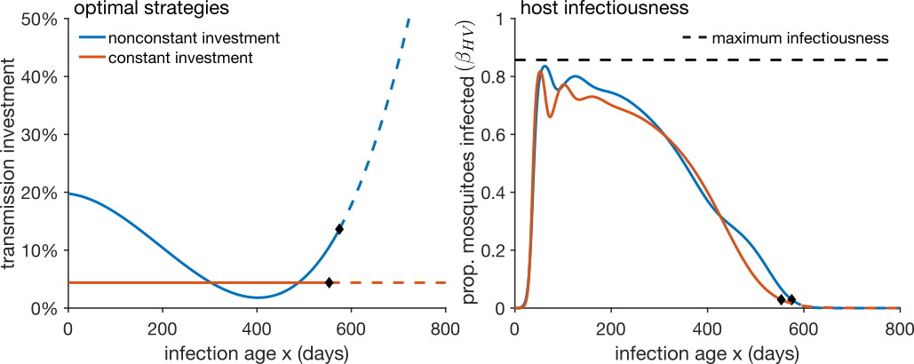
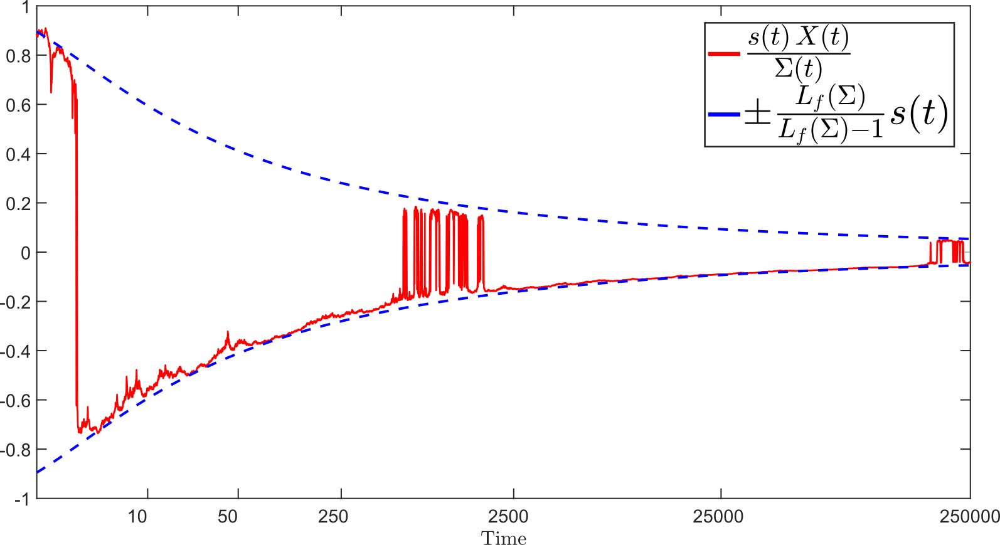

My research lies at the interface of **nonlinear dynamics**, **stochastic analysis**, and **mathematical modelling**. My graduate work examined qualitative properties of nonlinear differential systems with memory and subject to random noise, with a focus on growth rates and blow-up of solutions in both deterministic and stochastic systems. My postdoctoral and subsequent research has applied mathematical methods — including dynamical systems, stochastic particle systems, and partial and integro-differential equations — to interdisciplinary collaborations in ecology, developmental biology, and epidemiology. See the [Publications](publications.qmd) page for a full list of papers.

## Mathematical Ecology

My ecology research focuses on **spatial models of vegetation dynamics** (especially forest-savanna ecosystems), **alternative stable states**, and **critical transitions** (abrupt regime shifts). Central themes are understanding how spatial heterogeneity and noise interact to shape the stability landscapes of ecosystems, and developing early-warning indicators for impending transitions.

**Mathematical methods:** stochastic interacting particle systems, spatial mean-field theory (propagation of chaos), integro-differential equations (IDEs), bifurcation analysis, pattern formation theory, and non-equilibrium landscape–flux analysis.

**Key results:**

- Rigorous probabilistic foundations for spatial mean-field models in ecology (*SIAM J. Appl. Dyn. Syst.*, 2020)
- Unification of deterministic and stochastic ecological dynamics via a landscape–flux framework (*PNAS*, 2021)
- Non-equilibrium early-warning signals for critical transitions in ecological systems (*PNAS*, 2023)
- Pattern formation and bifurcation structure in forest-savanna systems (*Bull. Math. Biol.*, 2024)

{fig-align="center" width="90%"}

## Mathematical Epidemiology: Malaria

I work on mathematical modelling of malaria at both the population and within-host scales.  Using age-structured PDE frameworks, my collaborators and I modelled the accumulation of anti-malaria immunity in humans and its consequences for parasite evolution and vaccine design. In terms of **within-host dynamics of malaria**, I have worked on the question of how immune pressures shape the evolution of parasite transmission investment.

**Mathematical methods:** age-structured partial differential equations, within-host PDE-ODE systems with immune dynamics, optimal control theory, evolutionary optimisation (adaptive dynamics), and seasonal forcing.

**Key results:**

- Age-structured PDE framework for the accumulation of anti-malaria immunity and its consequences for parasite evolution and vaccine design (*SIAM J. Appl. Math.*, 2023)
- Demonstration that acquired immunity imposes a reproduction–survival tradeoff on malaria parasites, shaping the evolution of transmission investment (*Evolution*, 2026)
- Malaria vaccination model incorporating seasonality and immune feedbacks (*PLoS Comput. Biol.*, 2025)

{fig-align="center" width="80%"}

## Functional Differential Equations

My doctoral research studied the qualitative behaviour of **Volterra integral and functional differential equations**, including the growth and blow-up of solutions in superlinear systems, large fluctuations in stochastic systems, and convergence rates to equilibrium.

**Mathematical methods:** Volterra integral and integro-differential equations, functional differential equations, Itô stochastic calculus, regular and slow variation, and sharp asymptotic analysis.

**Key results:**

- Sharp characterisation of growth rates and finite-time blow-up in superlinear Volterra systems (*SIAM J. Math. Anal.*, 2018; *DCDS*, 2018)
- Precise almost-sure asymptotic bounds on solutions of nonlinear stochastic functional differential equations (*Appl. Math. Comput.*, 2021)
- Classification of convergence rates to equilibrium in perturbed ODEs with regularly varying nonlinearity (*Electron. J. Qual. Theory Differ. Equ.*, 2016)

{fig-align="center" width="70%"}