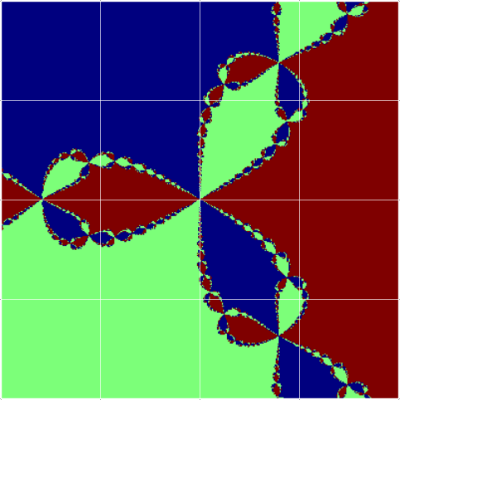
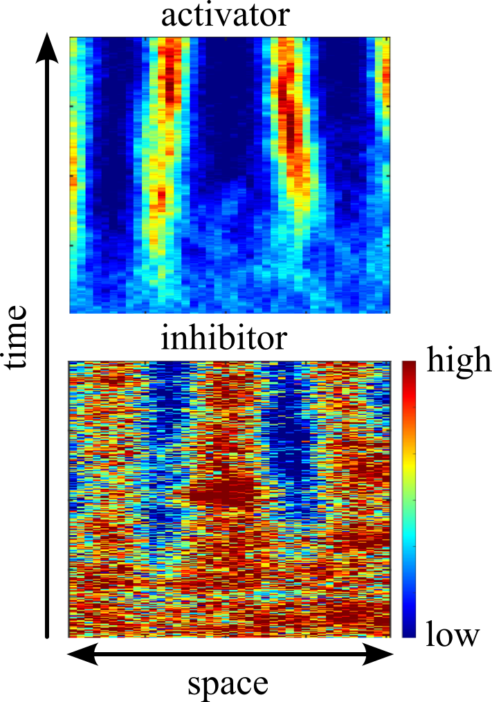

Teaching is one of the most enjoyable parts of my job, and I am committed to teaching to the highest standard possible; my [teaching statement](assets/teaching-statement.pdf) outlines my teaching philosophy in more detail. Below are some materials related to courses I have taught and developed. Typos and corrections in any course materials are always welcome!

## Durham University

:::: {layout="[50, 50]" layout-valign="top"}
::: {}
**Computational Mathematics II (MATH2731)** — *Winter 2025*

A hands-on introduction to numerical analysis and scientific computing, covering algorithms for root-finding, interpolation, numerical integration, and the numerical solution of ordinary and partial differential equations.

- [Course notes](https://patterd2.github.io/MATH2731_Comp_Math/) (HTML)

This course is assessed by weekly computational lab reports and e-assessments (50%), and a computational project grounded in one of the research areas of the department (50%).
:::

::: {}
{fig-align="center" width="75%"}
:::
::::

:::: {layout="[50, 50]" layout-valign="top"}
::: {}
**Advanced Mathematical Biology IV (MATH4411)** — *Winter 2023, 2024, 2025*

An advanced course in the mathematical modelling of biological systems. Michaelmas term covers stochastic models, including simulating and analysing discrete-state Markov processes, reaction-diffusion processes, and stochastic differential equations.

- [Michaelmas term notes 2025](https://patterd2.github.io/MATH4411_Adv_Math_Bio_Notes/) (HTML)
- [Michaelmas term notes 2024](assets/durham-adv-math-bio-2024.pdf) (PDF)
- [Course GitHub page](https://github.com/patterd2/MATH4411_Adv_Math_Bio) (code)

Epiphany term covers continuum-mechanical models of biological media, including non-Newtonian fluids, solids, and viscoelastic media.

:::

::: {}
{fig-align="center" width="75%"}
:::
::::

## Brandeis University

**Differential Equations** — *Summer 2020*

An introduction to ordinary differential equations from a dynamical systems perspective, covering qualitative methods, phase plane analysis, and applications.

<small>Text: Blanchard, P., Devaney, R. L., & Hall, G. R. (2012). *Differential Equations* (4th ed.). Brooks/Cole.</small>

**Probability** — *Fall 2019*

- [Course notes](assets/brandeis-probability-notes.pdf) (PDF)

<small>Text: Ross, S. M. (2012). *A First Course in Probability*. Pearson.</small>

**Multivariable Calculus** — *Spring 2019*

- [Course notes](assets/brandeis-multivariable-calculus-notes.pdf) (PDF)

<small>Text: Marsden, J. E., & Tromba, A. (2011). *Vector Calculus*. W. H. Freeman.</small>

## Dublin City University

**Simulation for Finance (MS455)** — *2017*

An introduction to probabilistic simulation methods and their applications in quantitative finance, covering Monte Carlo methods, stochastic processes, and the pricing of financial derivatives.

- [Course notes](assets/dcu-simulation-finance-2017.pdf) (PDF)
